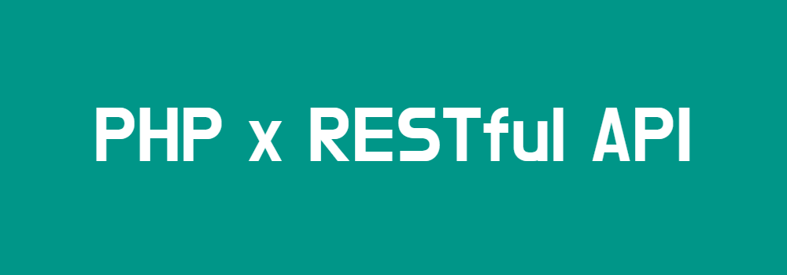

<div id="start" hidden></div>



<h1 align=center>Todo List App 🧾</h1>

<div align="center">
	
	
	
</div>
<div align="center" style="margin-top: 10px;">
	
</div>

### Описание

**Краткое описание**

Restful Api интерфейс для управления задачами разработанный на PHP. Данный API позволяет создавать, редактировать, удалять и получать задачи, хранящиеся в базе данных

**Эндпоинты**

- _GET_ `/tasks` - Получение всех задач
- _GET_ `/tasks/{id}` - Получение задачи
	- требуется id в запросе
- _POST_ `/tasks` - Создание задачи
	- требуется id в запросе
	- требуется json с полями `title`, `description`, `status`
- _PUT_ `/tasks/{id}` - Обновление задачи
	- требуется id в запросе
	- требуется json с полями `title`, `description`, `status`
- _DELETE_ `/tasks` - Удаление задачи
	- требуется id в запросе

### Общие правила валидации

**Требуемые данные**

Запрос на **получение всех** задач не требует данных

Запросы на **получение конкретной** задачи и **обновление** задачи требуют обязательного `id` в URL запроса:

`/tasks/{id}`

Запросы на **создание** и **обновление** задачи требуют обязательного предоставления следующих полей:

`title` — название задачи (обязательно)
`status` — статус задачи (обязательно, допустимые значения: finished, unfinished)

`description` — описание задачи (необязательно)

**Требования к параметрам:**

Поле `title` должно быть не короче 6 символов и не длиннее 255 символов
Поле `description` не должно превышать 500 символов
Поле `status` может быть одним из двух значений: `"finished"` / `"unfinished"`

### Примеры ответов

**Успешные ответы**

- Все успешные ответы содержат поле `"status": "success"` и `"message": "..."`, при всех методах кроме удаления также возвращается поле `"data": {...}` содержащий объект задачи или задач если получение всех задач

<em>Обычный ответ без ресурса</em>
```json
{
	"status": "success",
	"message": "Комментарий к ответу" 
}
```

<em>Ответ содержащий ресурс</em>

```json
{
	"status": "success",
	"message": "Комментарий к ответу",
	"data": {
		"id": "ID задачи",
		"title": "Название задачи",
		"description": "Описание задачи (если имеется)",
		"status": "Статус задачи: finished / unfinished"
	}
}
```

<em>Ответ содержащий ресурсы</em>

```json
{
	"status": "success",
	"message": "Комментарий к ответу",
	"data": [
		{
		"id": "ID задачи",
		"title": "Название задачи",
		"description": "Описание задачи (если имеется)",
		"status": "Статус задачи: finished / unfinished"
		},
		/* ... */
	]
}
```

**Ответы ошибок**

- Все ответы ошибок содержат `"status": "failed"` и `"message": "..."`

<em>Обычный ответ неудачного запроса</em>
```json
{
	"status": "failed",
	"message": "Описание ошибки" 
}
```

### Статусы ответов

- **200** (OK): Успешное выполнение запроса
- **201** (Created): Успешно создана новая задача
- **400** (Bad Request): Ошибка валидации (отсутствуют обязательные поля, неверный формат данных)
- **404** (Not Found): Задача не была найдена по указанному ID
- **422** (Unprocessable Entity): Ошибка на уровне базы данных. Выполненное неуспешно действие над ресурсом в БД
- **500** (Internal Server Error): Внутренняя ошибка сервера при любых других Exceptions, Errors и Fatal Errors

> ...